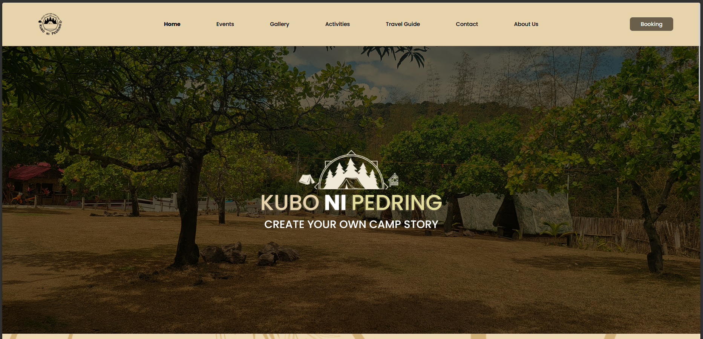

# Kubo ni Perding
### Campsite Resort
Description:
Kubo ni Perding is a campsite resort in Rizal, Philippines. This project is a simple website that showcase their services and fun activities.
The website consists of multiple static pages (e.g. Home, About, Contact, Gallery, Activities, Travel Guide, and Booking).

**Tech Start**:
- JavaScript
- HTML + CSS
- BootStrap
- Figma (Design)
- Netlify (Hosting)

# How to run the project
To run the project:
- Using Node.js `npx http-server`.
- Using Python `python -m http.server`.
- Using VS Code Live Server.

# What I Learned from this Project.
- I learned to apply the basics of HTML, CSS, and JavaScript.
- I learned to use Bootstrap Framework.
- I learned how to communicate with client and collaborate with a team in designing and developing a website.
- I learned how to use Figma to design a website.
- I learned how to use Git and GitHub to version control my project.
- I learned how to use VS Code to edit my project.
- I learned how to use Node.js to run my project.
- I learned how to host my project on Netlify.